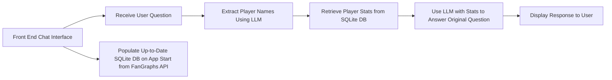

# MLB Baseball Help Bot - AIPI 561

[](https://github.com/mkeohane01/baseball-assistant/actions/workflows/ci.yml)
[](https://github.com/mkeohane01/baseball-assistant/actions/workflows/cd.yml)

The purpose of this application is to provide a chat interface where users can ask questions about baseball players and receive responses based off of up to date 2024 statistics. It pulls real information from a pre-loaded database full of data scraped from Baseball Reference.

[Demo Video](https://youtu.be/BShVZRrhikI)

Packages Used
- [PyBaseball API](https://github.com/jldbc/pybaseball)

LLM Used

Test both tinyllama as well as a 13B model. Found that tinyllama couldn't understand longer prompts and was not very consistent while the 13B model was extreamly slow.
- [Llama3 8B llamafile](https://huggingface.co/Mozilla/Meta-Llama-3-8B-Instruct-llamafile)

## To Run
Need to run both the llamafile and the flask app simulataniously to use this application. Follow the instructions below. The make commands only work on linux-like systems.

**Flask App**
- Set up .flaskenv from example
- Create a virtual enviornment ```python -m venv .venv```
- Source the venv then download requirements ```pip install -r requirements.txt```
- In base folder: ```flask run```

    *or*

- ```make docker```

**LLM**
- ```bash run_llama_model.sh```

    *or*
- ```make llamafile```

## Architecture



## Evalutaion

In order to test this application, I created two tests. One of which specifically tests the player extraction llm and the other more qualitatively tests the full pipeline outputs.

I built a test set of 37 possible questions in ```tests/extraction_test_set.json```

To run these tests either:
* ```make llm-test```

*or*

* ```python tests/test_llmpipeline.py```

### Results

**Extraction**

To test the extraction stage, I created a test set that contains various questions along with the expected extracted output. After running this test, I got an accuracy of 100%. All 37 tests extracted the player name properly from the question.

The average time for player extraction for this test was 6.46s

**Full Pipeline**

For all 37 tests, the pipeline never threw an error. Looking over the answers myself, I found that they were often good and succint if the user asks for a specific statistic to compare players on. On the other hand, some responses were long-winded and unhelpful when the question was more vauge. 

Logs of the questions with outputs can be found at ```tests/pipeline_results.json```

Overall for these 37 questions, the average response time for the pipeline was 38.61 seconds

## Repo Structure
```
├── .github/
│ └── workflows/
|   ├── ci.yml # GitHub Actions CI/CD workflow for Continuous Integration
│   └── cd.yml # GitHub Actions CI/CD workflow for Continuous Deployment
|
├── app/
│ ├── static/ # Static files (CSS, JS, images, etc.)
│ ├── templates/ # HTML templates
│ ├── __init__.py # Starts the app
│ └── routes.py # Flask server
|
├── src/
| ├── __init__.py # Make it a package
| ├── utils.py # Helpful functions to call llm and read db
| ├── llm_pipelining.py # Main script that calls the llm pipeline
│ └── populate_db.py # Script to populate the database
|
├── tests/
| ├── test_app.py # Unit tests for tools
| ├── test_llmpipeline # LLM tests for the pipeline
| ├── pipeline_results.json # Results from pipeline test
│ └── extraction_test_set.json # Test set
|
├── baseball_stats.db # SQLite db built on app start
├── Dockerfile # Main Dockerfile for building the app
├── Makefile # Makefile for various useful commands
├── run_hf_model.sh # Downloads and runs the NexusRaven13B LLM
├── run_llama_model.sh # Downloads and run the Llama3 8B LLM
├── .flaskenv # Environment variables for Flask
├── .gitignore # Git ignore file
├── .dockerignore # Docker ignore file
├── requirements.txt # Python dependencies
└── README.md
```

## Future Work

While this application does a great job at pulling 2024 MLB statistics, there are a lot of pathways to improve the overall experience of this application.

1. Continue the conversation and be able to recommend similar player names if they mistype a player name.
2. More thoughly test the full LLM pipeline
3. Improve the prompting and context of the question answering stage to make it understnad how to use the statistics to make succint accurate questions.
4. Add a feature to connect to your fantasy baseball league in order to convert statistics to points as well as being able to observe your team's sucess and avaliable players to claim
5. UI/UX improvements as well as cutting down to LLM latency.