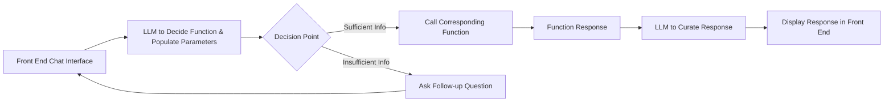

# Fantasy Baseball Help Bot - AIPI 561

[](https://github.com/mkeohane01/baseball-assistant/actions/workflows/ci.yml)

[](https://github.com/mkeohane01/baseball-assistant/actions/workflows/cd.yml)

Build an application where users can ask questions about baseball players, check in on their own league/team, and seek advice about free agent options. It will pull real information either directly from the sources using APIs or through pre-loaded databases and webscraping.

Useful packages / APIs:
- [ESPN Fantasy API](https://github.com/cwendt94/espn-api)
- [Statcast Advanced Metrics](https://github.com/jldbc/pybaseball)

LLM 
- [Huggingfcae GGUF](https://huggingface.co/TheBloke/NexusRaven-V2-13B-GGUF)
## AI Agent

Goal is to build an AI Agent that can call certain functions based on the input query. I may have to simplify this project to a premade db and rag.

An example pipeline could be:
1. SLM decides whether player data, team data, free agent data, or none is asked about.
2. SLM also pulls requested player/team-name/position/stat to be used in function
3. Call corresponding function populated with the extracted parameters (decision tree / flow chart)
4. Feed extracted info to LLM for quality response

## Timeline (Weeks)
0. Project discovery
1. Exploring APIs and baseball data sources
2. Reseach and Design AI Agent pipeline
3. Build AI Agent pipeline - or decide to pivot to RAG
4. Research best SLMs/LLMs to use in this pipeline
5. Connect LLMs to Agent pipeline with APIs
6. Start building user interface
7. Continue UI and implement tests
8. Ensure CI/CD is robust and dockerizes
9. Continued testing and debugging
10. Documentation and Clean up

## LLM Pipelining

Issues and Ideas
- Need to determine which function to call
    - Give good descriptions of functions
    - Few shot examples for in context learning
- Output from the LLM needs to be formated exactly to choose and populate function
    - Few Shot propmting
    - choose function, then populate variables
- After getting info, need LLM to know how to use it
    - Incorporate pipeline to process data

## Architecture



## Functions
```python
- get_hitter_info_statcast(player_name, daterange, specific_stat=None)

- get_pitcher_info_statcast(player_name, daterange, specific_stat=None)

- get_fantasy_points(player_name, daterange)

- get_hitter_info_fangraphs(player_name, daterange)

- get_pitcher_info_fangraphs(player_name, daterange)

```