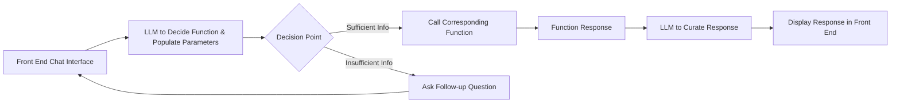

# Fantasy Baseball Help Bot - AIPI 561

[](https://github.com/mkeohane01/baseball-assistant/actions/workflows/ci.yml)
[](https://github.com/mkeohane01/baseball-assistant/actions/workflows/cd.yml)

Build an application where users can ask questions about baseball players and seek advice about fantasy baseball related trades. It will pull real information from a pre-loaded database full of updated statistics.

Useful packages / APIs:
- [ESPN Fantasy API](https://github.com/cwendt94/espn-api)
- [Statcast Advanced Metrics](https://github.com/jldbc/pybaseball)

LLMs
- [Huggingfcae GGUF](https://huggingface.co/TheBloke/NexusRaven-V2-13B-GGUF)
- [Llama3 llamafile](https://huggingface.co/Mozilla/Meta-Llama-3-8B-Instruct-llamafile)

## AI Pipeline
- Recieve user question
- Extract player names
- Get stats from db for players
- Formulate response of origional question using player data

## Architecture



## Repo Structure
```
├── .github/
│ └── workflows/
|   ├── ci.yml # GitHub Actions CI/CD workflow for Continuous Integration
│   └── cd.yml # GitHub Actions CI/CD workflow for Continuous Deployment
├── app/
│ ├── static/ # Static files (CSS, JS, images, etc.)
│ ├── templates/ # HTML templates
│ ├── __init__.py
│ └── routes.py # Flask server
│
├── src/
| ├── llm_pipelining.py # Main script that calls the llm pipeline
│ └── populate_db.py # Script to populate the database
│
├── test/
|
├── Dockerfile # Main Dockerfile for building the app
├── Makefile # Makefile for various useful commands
├── run_hf_model.sh # Downloads and runs the NexusRaven13B LLM
├── run_llama_model.sh # Downloads and run the Llama3 8B LLM
├── .flaskenv # Environment variables for Flask
├── .gitignore # Git ignore file
├── .dockerignore # Docker ignore file
├── requirements.txt # Python dependencies
└── README.md
```

## To Run
**Flask App**
- Set up .flaskenv
- In base folder: ```flask run```

    *or*

- ```make docker```

**LLM**
- run ```bash run_llama_model.sh```

    *or*
- ```make llamafile```